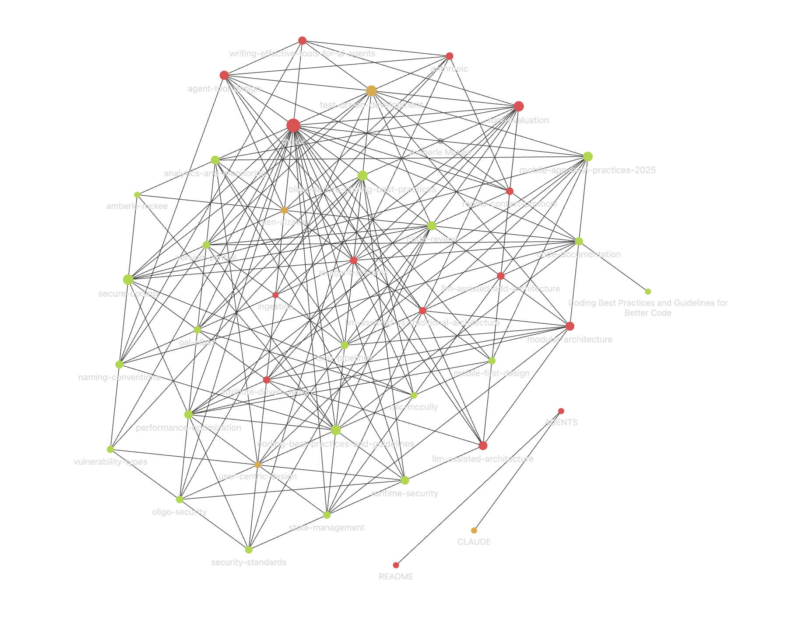

<div align="center">

# AI Knowledge Engine

### A self-compounding knowledge base maintained by LLM agents


*Not a note-taking app. Not a RAG pipeline. A living knowledge graph that compounds.*

</div>

---

## The Problem with RAG

Standard RAG systems retrieve documents and re-derive answers from scratch on every query. Nothing is built up. Ask the same question a hundred times and the system does the same work each time. Add fifty documents and the synthesis still happens at query time, fragile and ephemeral.

This system takes a different approach: **compile knowledge once, compound it continuously.**

An LLM agent reads each new source, extracts what matters, and integrates it into a persistent, typed knowledge graph — updating concept pages, creating entity links, flagging contradictions, and deepening synthesis incrementally. By the time you ask a question, the answer is already mostly written. The graph reflects everything ever ingested, not just the last retrieval.

The more you feed it, the smarter it gets. The connections compound.

---

## What It Actually Does

**You drop in one article. Here is what happens:**

A 3,000-word security article on secure coding practices gets ingested. The agent reads it, surfaces three key takeaways for your review, then writes:

- `knowledge/sources/oligo-secure-coding-best-practices.md` — full structured summary with key points, entities, and open questions
- Updates `knowledge/concepts/secure-coding.md` — adds specific crypto algorithms (AES, RSA/ECC, TLS 1.3), obfuscation techniques, and a formal standards table (OWASP, CERT, NIST, ISO 27001) that weren't there before
- Creates `knowledge/concepts/runtime-security.md` — a new concept this source introduced, already cross-linked to secure-coding and vulnerability-types
- Creates `knowledge/concepts/vulnerability-types.md` — buffer overflows, integer overflows, format strings, race conditions — all categorised in a comparison table
- Creates `knowledge/entities/gal-elbaz.md` — the expert contributor, linked back to the source and to every concept he informed
- Updates `knowledge/index.md` — new pages catalogued, page count incremented
- Appends to `logs/ingestion.md` — timestamp, pages created, pages updated, contradictions found (none), open questions captured

**One article. One command. Nine files touched.**

Now you ingest a second source that covers similar ground. The agent reads the existing `secure-coding.md` page before writing anything. It finds a gap the first source didn't cover — certificate pinning and OAuth 2.0 for mobile — and adds a mobile security section. It also notes that the new source explicitly confirms the OWASP recommendations from the first, strengthening those claims. It does not duplicate; it integrates.

**After four sources, the `secure-coding` concept page draws from all of them** — synthesised, cross-referenced, with a contradictions section that tracks where sources diverge and an open questions section that tracks what remains unresolved. No single source could have produced that page. The agent built it incrementally, the same way a researcher would — except it never forgets what it read and never skips the filing.

**When you ask a question:**

> *"What are the most important secure coding practices for a mobile fintech app?"*

The agent reads `knowledge/index.md`, identifies five relevant pages, reads them, and returns a structured answer with inline citations — already synthesised across everything ingested. The answer references specific algorithms, formal standards, and mobile-specific patterns. It then offers to file the response as `knowledge/analyses/secure-coding-fintech-mobile.md` so the synthesis becomes a permanent part of the base.

---

## Architecture

```
                         ┌─────────────────────────────────────────┐
                         │            AGENTS.md                    │
                         │   Schema · Workflows · Behavioral Rules  │
                         └────────────────┬────────────────────────┘
                                          │ governs
                                          ▼
┌──────────────┐   ingest   ┌─────────────────────────┐   writes   ┌──────────────────────┐
│  Raw Sources │──────────▶ │       LLM Agent         │──────────▶ │   Knowledge Base     │
│              │            │                         │            │                      │
│  Articles    │            │  • Reads index          │            │  knowledge/          │
│  Papers      │            │  • Extracts structure   │            │  ├── concepts/   21  │
│  Transcripts │            │  • Updates cross-refs   │            │  ├── sources/     5  │
│  Reports     │            │  • Flags contradictions │            │  ├── entities/    6  │
│  Notes       │            │  • Maintains audit log  │            │  ├── analyses/    1  │
└──────────────┘            └─────────────────────────┘            │  └── overviews/   1  │
  gitignored                                                        └──────────────────────┘
  (source of truth)                                                   versioned · linked · typed
```

**The three layers:**

| Layer | Role | Mutability |
|---|---|---|
| `raw/` | Original source documents | Immutable — never modified |
| LLM agent | Reads `AGENTS.md`, maintains knowledge base | Stateless — governed by schema |
| `knowledge/` | Compiled, typed, interlinked knowledge graph | Append + update — versioned in git |

---

## Key Design Decisions

**Index-first navigation, not embeddings** — `knowledge/index.md` is a structured catalog the agent reads at session start. At moderate scale (~100 sources, ~hundreds of pages), this outperforms embedding-based retrieval for structured knowledge — no vector infrastructure, no latency, no cost per query.

**Schema enforced in plain English** — the page schemas and workflows live in `AGENTS.md`, not in code. Any LLM that can read instructions and edit files can run this system. No SDK dependency, no vendor lock-in.

**Contradiction tracking as a first-class feature** — every source page has a `## Contradictions` section. When a new source conflicts with existing knowledge, the conflict is flagged explicitly on both the source page and the affected concept page. Nothing is silently overwritten. The knowledge base knows what it does not know.

**Compile-once, query-fast** — synthesis happens at ingest time, not query time. By the time you ask a question, the relevant pages have already been written, cross-referenced, and updated across multiple sources. Queries read compiled knowledge rather than re-deriving it from raw documents each time.

---

## Features

- **5 typed page schemas** — `concept`, `entity`, `source`, `analysis`, `overview`; each with a mandatory section structure enforced by `AGENTS.md`
- **Mandatory YAML frontmatter** — `title`, `type`, `tags`, `created`, `updated`, `sources` on every page; machine-readable and queryable
- **Explicit contradiction and gap tracking** — `## Contradictions` and `## Open Questions` sections on every page; conflicts between sources are flagged explicitly, never silently overwritten
- **Graph-native cross-linking** — wiki-link syntax creates a navigable knowledge graph visible in Obsidian's graph view
- **4 deterministic agent workflows** — `ingest`, `query`, `lint`, `update`; each a step-by-step procedure with defined inputs, outputs, and stopping criteria
- **Append-only audit log** — every operation recorded in `logs/ingestion.md` with timestamp, pages changed, and findings
- **Utility scripts** — `lint_frontmatter.py`, `search.py`, `stats.py`; stdlib-only, no dependencies
- **CI validation** — GitHub Actions workflow validates frontmatter schema on every push
- **Reusable templates** — blank scaffolds for every page type in `templates/`; portable to any new domain
- **Agent-agnostic** — `AGENTS.md` is plain English; works with Claude, GPT-4, Gemini, or any LLM that can read instructions and edit files
- **Git-native** — the knowledge base is a Markdown repo; branching, history, and diffing work out of the box

---

## Current Knowledge Base

| Domain | Concept Pages | Key Topics |
|---|---|---|
| **Software Engineering** | 6 | Naming conventions, documentation, TDD + testing pyramid, code review, version control, performance |
| **Security** | 4 | Secure coding (OWASP/CERT/NIST/ISO), runtime security, vulnerability taxonomy, cryptography |
| **AI Agent Systems** | 3 | Agent tool design (5 principles), tool evaluation methodology, Model Context Protocol |
| **Mobile Development** | 6 | Mobile-first design, CI/CD pipelines, state management (Redux/Bloc), modular architecture, analytics |
| **Software Architecture** | 2 | Attribute-Driven Design (ADD), LLM-assisted architecture, human-in-the-loop design collaboration |

**5 sources ingested · 21 concept pages · 6 entity pages · 1 analysis · 1 domain overview · 5 domains**



*The knowledge graph in Obsidian — 34 pages across 5 domains. Red nodes are highest-linked (index, agent-tool-design, tool-evaluation). Every edge is a wiki-link maintained by the agent.*

---

## Getting Started

### Prerequisites

| Tool | Required | Purpose |
|---|---|---|
| [Claude Code](https://claude.ai/code) | Yes | LLM agent runtime — runs all four workflows |
| Git | Yes | Clone and version the knowledge base |
| [Obsidian](https://obsidian.md/) | Recommended | Graph view, wiki-link navigation, local Markdown editor |

Install Claude Code via npm or download the desktop app:

```bash
npm install -g @anthropic-ai/claude-code
```

### Setup

```bash
# Clone the repository
git clone https://github.com/AkamAzizi/ai-knowledge-engine
cd ai-knowledge-engine
```

**Open in Obsidian *(recommended)*:** Obsidian → File → Open Vault → select the `ai-knowledge-engine` folder. This enables the graph view and wiki-link navigation.

**Start a Claude Code session in the repository root:**

```bash
claude
```

Claude Code reads `CLAUDE.md` on startup, which points the agent to `AGENTS.md`. The agent loads the full operating manual and `knowledge/index.md` before doing anything. You are ready.

---

## How to Use

All workflows are triggered by natural language inside a Claude Code session — not shell commands. Open Claude Code in the repository root and type the prompts below.

### 1. Ingest a source

Save any article, paper, transcript, or notes file as a Markdown file in `raw/`. [Obsidian Web Clipper](https://obsidian.md/clipper) converts web pages to local Markdown in one click.

Then, in Claude Code:

```
ingest raw/your-file.md
```

The agent will:
1. Read the source and surface 2–3 key takeaways for your review
2. Confirm emphasis before writing anything
3. Create `knowledge/sources/<slug>.md` — structured summary with key points, entities, and open questions
4. Create or update relevant concept and entity pages
5. Update `knowledge/index.md` and append an entry to `logs/ingestion.md`

> **Example:** ingesting a 3,000-word security article produced one source page, three new concept pages, one updated concept page, and nine total file changes — in a single session.

### 2. Query the knowledge base

Ask any question in plain language:

```
What are the most important secure coding practices for a mobile fintech app?
```

The agent reads `knowledge/index.md`, identifies the relevant pages, and returns a structured answer with inline citations linking to specific knowledge pages. It then offers to file the answer as a permanent analysis page under `knowledge/analyses/`.

### 3. Health-check (lint)

```
lint
```

The agent audits all knowledge pages and reports:

- Contradictions between pages
- Stale claims superseded by newer sources
- Orphan pages with no inbound links
- Concepts mentioned across pages but without their own page
- Missing cross-references and data gaps

It will present a plan and ask for confirmation before applying fixes to more than 5 files.

### 4. Update an existing page

```
Update the secure-coding concept page — add the new NIST guidelines from raw/nist-update.md
```

The agent reads the existing page, makes targeted changes only, updates the `updated:` frontmatter date, and refreshes the page's summary in `knowledge/index.md`.

---

### Utility Scripts

Run these independently of Claude Code for quick inspection or CI validation:

```bash
# Validate YAML frontmatter on all knowledge/ pages
python scripts/lint_frontmatter.py

# Search by keyword or regex with optional type filter
python scripts/search.py "OAuth" --type concept

# Print page counts, most-linked nodes, and orphan detection
python scripts/stats.py
```

---

**Full operating manual:** [`AGENTS.md`](./AGENTS.md) — covers all workflows, page schemas, naming conventions, and behavioral rules in detail.

---

## Repository Structure

```
ai-knowledge-engine/
├── README.md                  ← This file
├── AGENTS.md                  ← LLM operating manual — schema, workflows, behavioral rules
├── CLAUDE.md                  ← Claude Code session bootstrap (points to AGENTS.md)
├── .gitignore
│
├── knowledge/                 ← The compiled knowledge base (the main artifact)
│   ├── index.md               ← Master catalog; agent reads this first every session
│   ├── concepts/              ← Idea, framework, and pattern pages
│   ├── sources/               ← One summary page per ingested document
│   ├── entities/              ← Person, organization, product, and tool pages
│   ├── analyses/              ← Deep-dive, comparison, and synthesis pages
│   └── overviews/             ← Domain-level synthesis and reading maps
│
├── templates/                 ← Reusable page scaffolds
│   ├── concept.md
│   ├── source.md
│   ├── entity.md
│   ├── analysis.md
│   └── project.md
│
├── scripts/                   ← Utility scripts (stdlib only, no dependencies)
│   ├── lint_frontmatter.py    ← Validate YAML frontmatter on all knowledge/ pages
│   ├── search.py              ← Keyword/regex search with optional --type filter
│   └── stats.py               ← Page counts, most-linked concepts, orphan detection
│
├── .github/workflows/
│   └── lint.yml               ← CI: runs lint_frontmatter.py on every push
│
├── logs/
│   └── ingestion.md           ← Append-only operations log with timestamps
│
└── raw/                       ← Source documents — local only, gitignored
```

---

## Use Cases

### Research and domain expertise

You are reading papers and articles on a topic over several weeks. Instead of highlights that go nowhere, you ingest each source as you read it. By source five, your concept pages reflect a synthesis no single paper contains — with explicit contradictions flagged, open questions tracked, and a reading map in the overview page. When you need to brief someone, the overview page is already written.

### System design and architecture

You are designing a new service. Ingest your ADRs (Architecture Decision Records), relevant design pattern references, and postmortems from past incidents. Query the base before each significant decision to surface precedents, check whether a proposed approach contradicts an earlier one, and identify what the existing knowledge says about the tradeoffs. Analysis pages become the architecture recommendation document.

### Technical writing and thought leadership

You want to write an article or talk on a topic you have been researching. After ingesting your sources, query the base with the specific question your piece answers. File the response as an analysis page. Your research is already organised, cited, and cross-referenced — the writing is the last step, not the longest one.

### Client and consulting engagements

For each engagement, maintain a dedicated vault. Ingest briefs, research documents, competitor analyses, and meeting transcripts as they arrive. The agent cross-references new material against what it already knows, flags where a new brief contradicts prior assumptions, and keeps entity pages (people, products, organisations) current. Query at any point to surface relevant context or synthesise a recommendation.

### Team knowledge management

Feed in incident postmortems, RFC documents, onboarding guides, and meeting notes. The agent handles the filing — linking decisions to the sources that informed them, tagging people and systems as entities, and flagging when new information contradicts an existing policy. New team members query the base rather than interrupting colleagues. The wiki stays current because the LLM does the maintenance no one else wants to do.

---

## Design Philosophy

> *"The tedious part of maintaining a knowledge base is not the reading or the thinking — it is the bookkeeping."*

Humans abandon wikis because the maintenance burden grows faster than the value. Cross-references fall out of date. Contradictions accumulate silently. Summaries go stale. The graph decays.

LLMs do not get bored. They do not forget to update a cross-reference. They can touch 15 files in one pass without losing track of what changed. The maintenance cost is near zero — which means the knowledge base stays healthy and the value compounds indefinitely.

The human's job is to curate sources, ask good questions, and think about what it all means. The LLM's job is everything else.

This project is in the spirit of Vannevar Bush's 1945 Memex — a personal, associatively linked knowledge store where the connections between documents are as valuable as the documents themselves. The part Bush could not solve was who maintains the links. That problem is now solved.

---

## Tech Stack

| Layer | Tool | Purpose |
|---|---|---|
| Knowledge editor | [Obsidian](https://obsidian.md/) | Graph view, local editor, wiki-link rendering |
| LLM agent runtime | [Claude Code](https://claude.ai/code) | File editing, multi-step reasoning, schema adherence |
| Knowledge format | Markdown + YAML | Portable, human-readable, git-native |
| Source clipping | [Obsidian Web Clipper](https://obsidian.md/clipper) | Convert web articles to local markdown |
| Agent protocol | [Model Context Protocol](https://modelcontextprotocol.io/) | Tool integration layer for agent-tool communication |
| Version control | Git | Full history, branching, diffing of the knowledge base |

---

## Roadmap

- [x] Analysis pages — `knowledge/analyses/llm-assisted-vs-traditional-architecture.md` filed
- [x] GitHub Actions lint workflow — `.github/workflows/lint.yml` validates frontmatter on every push
- [x] Search script — `scripts/search.py` with keyword/regex search and `--type` filter
- [ ] Domain overview pages — one complete (`ai-agent-systems`); more domains to follow
- [ ] Multi-domain projects — `knowledge/projects/` for applying the base to real engagements
